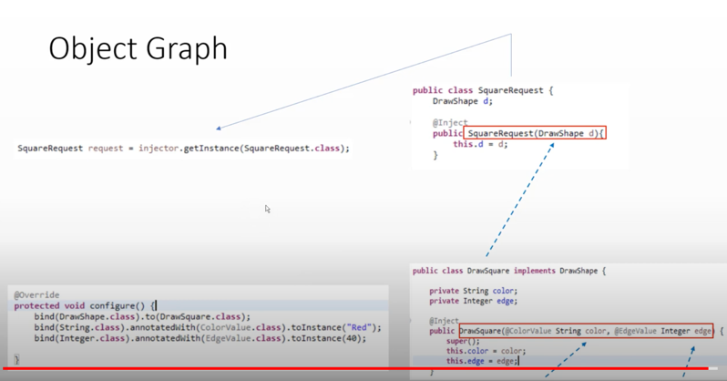
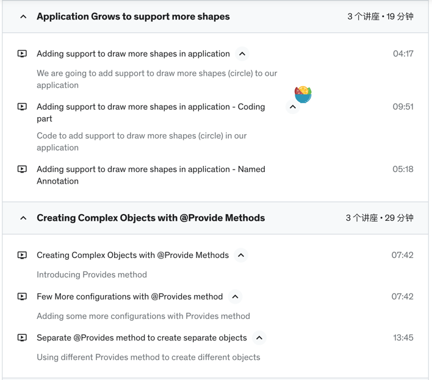
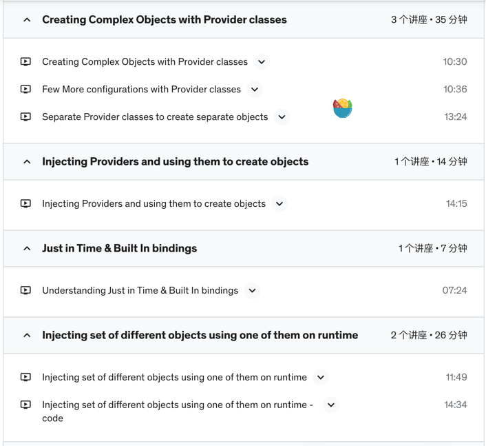
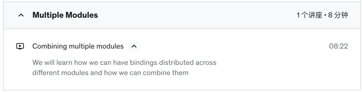

<!-- TOC -->

* [Github](#github)
* [Description](#description)
* [Images](#images)
* [@BindingAnnotation vs @Named](#bindingannotation-vs-named)
* [@BindingAnnotation vs @Qualifier](#bindingannotation-vs-qualifier)
* [toInstance](#toinstance)
* [Factory](#factory)

<!-- TOC -->

# Github

- [Guice](https://github.com/eugenp/tutorials/tree/master/di-modules/guice)

# Description

- If TypeA is an interface, then, we must have bindings to concrete classes.

```java
bind(TypeA.class).to(ConcreteTypeA.class);
```

`- If TypeA is a concrete class, then, we can bind it to itself.`

1. No Bindings
2. Bindings to itself

```java
bind(TypeA.class).to(SubClassOfTypeA.class);
```

# Images






# @BindingAnnotation vs @Named

- @BindingAnnotation is a custom annotation that you create.
- @Named is a built-in annotation that comes with Guice.
- They can be used interchangeably.

# @BindingAnnotation vs @Qualifier

- @BindingAnnotation is a custom annotation that you create.
- @Qualifier is a built-in annotation that comes with Guice.
- They can be used interchangeably.
- Older code may still use Guice `BindingAnnotation` in place of the standard `Qualifier` annotation.
- `@Qualifier` annotation. New code should use `@Qualifier` instead.

# toInstance

- `bind(String.class).toInstance("jdbc:mysql://localhost/pizza");`
- bindConstant() is a shortcut for toInstance() for primitive types and strings.

# Factory

- [medium](https://jamesonwilliams.medium.com/guicin-up-abstract-factories-like-a-di-boss-f11997d75ce2)
- [stackoverflow](https://stackoverflow.com/questions/27871631/gof-standard-factory-pattern-using-guice)
- [https://stackoverflow.com/questions/17669413/can-guice-automatically-create-instances-of-different-classes-based-on-a-paramet](https://stackoverflow.com/questions/17669413/can-guice-automatically-create-instances-of-different-classes-based-on-a-paramet)

# Multibinding & MapBinder & SetBinder & Multibinder

- [https://medium.com/@AlexanderObregon/guice-multibindings-leveraging-the-power-of-set-and-map-bindings-6bea4ee247fa](https://medium.com/@AlexanderObregon/guice-multibindings-leveraging-the-power-of-set-and-map-bindings-6bea4ee247fa)
- [https://github.com/google/guice/wiki/Multibindings](https://github.com/google/guice/wiki/Multibindings)

# AssistedInject

- [https://www.youtube.com/watch?v=3uAR5sFgh2A&list=PLKiN3faYVq89TjVuba-F62_nKBpcFdOWz&index=2](https://www.youtube.com/watch?v=3uAR5sFgh2A&list=PLKiN3faYVq89TjVuba-F62_nKBpcFdOWz&index=2)
- [Github](https://github.com/mvpjava/google-guice-tutorials)
- [https://toshiyakomoda.medium.com/guice-assistedinject-f49b29105651](https://toshiyakomoda.medium.com/guice-assistedinject-f49b29105651)
- [Dagger](https://dagger.dev/dev-guide/assisted-injection.html)
